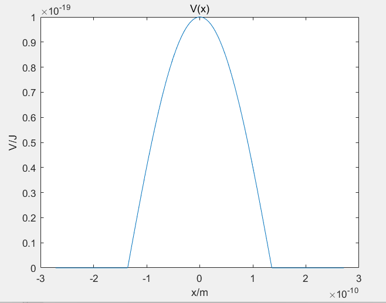
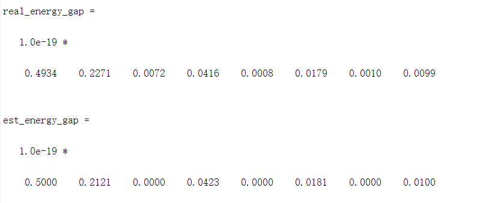

# 固体物理——能带计算

## 一、绘制势能分布曲线

势场具有周期性，因此只需只绘制一个周期内的势场。代码如下：

~~~matlab
a = 5.43e-10;
m0 = 9.1e-31;
h = 6.63e-34;
V = @(x)1e-19 * cos(2 * pi / a .* x) .* (x >= -a / 4 & x <= a / 4);
x = linspace(-a / 2, a / 2, 1000);
plot(x, V(x));
title('V(x)');
xlabel('x/m');
ylabel('V/J');
~~~

结果如下：

## 二、绘制简约布里渊区图景

首先需要计算势场 `V` 的傅里叶级数，可通过积分方法计算。这里，我希望绘制前9条能带，因此需要计算17个傅里叶级数。于是在如下代码中，我令`N=8`进行计算：

~~~matlab
N = 8;  % for simplicity, let N be an even integer.
assert(mod(N, 2) == 0);
VN = zeros(1, 2 * N + 1);
for i = 1: 1: 2 * N + 1
    n = i - N - 1;
    VN(i) = real(integral(@(x)V(x) .* exp(-1j * n .* x * 2 * pi / a), -a / 2, a / 2) / a);
end
figure(2);
stem(-N: N, VN);
xlim([-N, N]);
title('Fourier Series');
xlabel('N');

~~~

将傅里叶级数可视化，如下图所示：

接下来求出本征方程的矩阵，截断成 $(N+1)*(N+1)$ 的矩阵，并计算特征值，得到能量。这里，需要固定波矢`k`来求能量`E`，波矢`k`遍历第一布里渊区。代码如下：

~~~matlab
VN_mat = zeros(N + 1);
for i = 1: 1: N + 1
    VN_mat(i, :) = VN(N + i: -1: i);
end
cof = (h / 2 / pi) ^ 2 / 2 / m0;
sample_num = 1001;  % must be odd
assert(mod(sample_num, 2) == 1);
k0 = linspace(-pi / a, pi / a, sample_num);
eigen_E = zeros(sample_num, N + 1);
for i = 1: 1: sample_num
    kN_val = linspace(k0(i) - 2 * pi * N / 2 / a, k0(i) + 2 * pi * N / 2 / a, N + 1);
    offset_diag = diag(kN_val .^ 2 .* cof);
    eig_mat = VN_mat + offset_diag;
    eigen_E(i, :) = eig(eig_mat);
end
~~~

绘制第一布里渊区各级能量曲线，得到简约布里渊区图景：

放大能带交界处，可以看到存在能隙：

## 三、计算实际带隙与微扰近似带隙

根据简约布里渊区图景，计算实际带隙，代码如下：

~~~matlab
real_energy_gap = min(eigen_E(:, 2: end) - eigen_E(:, 1: end - 1), [], 1);
~~~

根据微扰理论计算出的带隙，为$2|V_n|$，因此可以在程序中计算出微扰近似得到的带隙，代码如下：

~~~matlab
est_energy_gap = 2 * abs(VN(N + 2: 2 * N + 1));
~~~

将二者进行对比，如下图所示：

数值上对比如下：

可以看到。二者非常接近，说明微扰近似是有效的。

## 四、对比布里渊区附近$(\Delta k=\pm \frac{2\pi}{10a})$的能带曲线

取出第2条和第3条能带曲线观察，在布里渊区边界附近$(\Delta k=\pm \frac{2\pi}{10a})$的部分绘图，结果如下：

可以看到布里渊区边界处近似于抛物线。